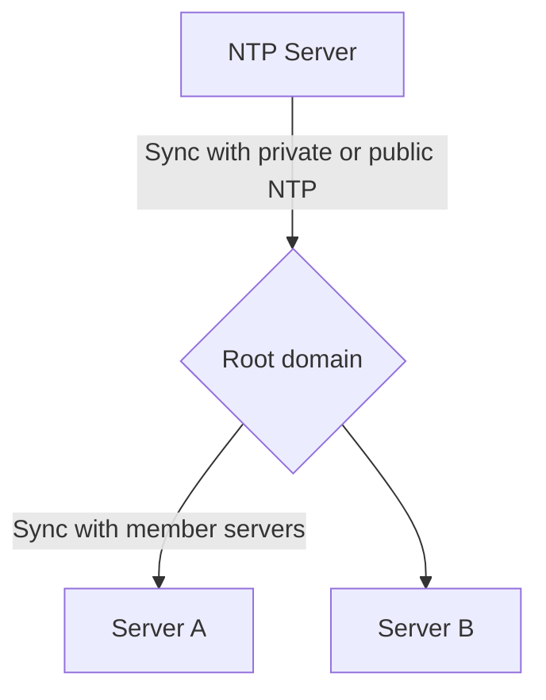
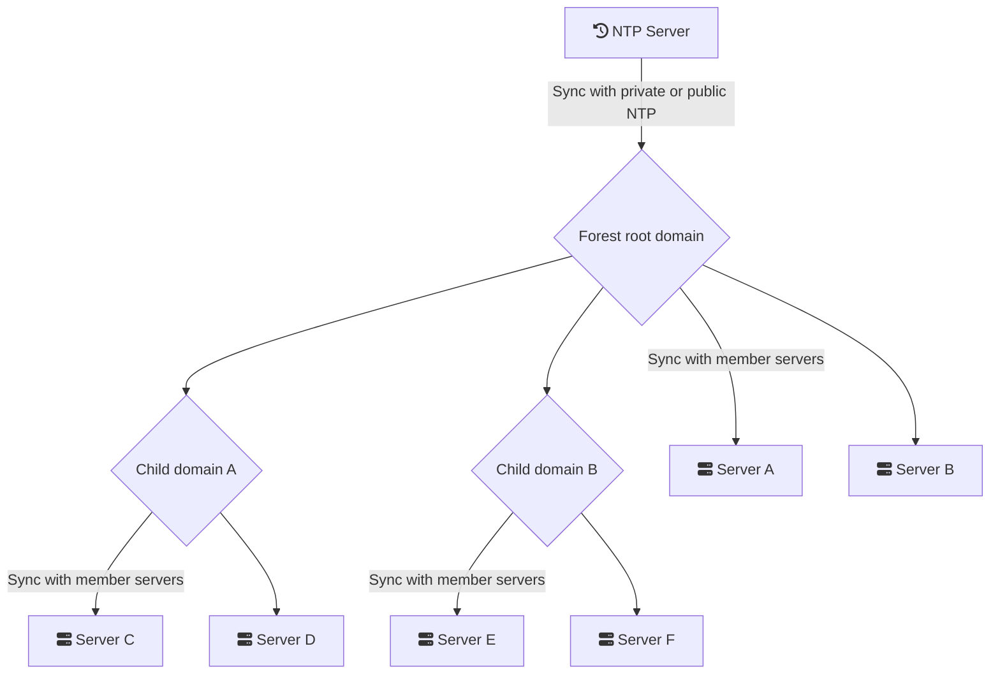

# Active Directory

## Time Synchronization

The time configuration is determined by the Time32 windows service.
According use case, your time toplogy will be different but based on the same principe of trusted source.

The top level domain use a trusted NTP server to sync time.
Each sub domain DC's sync time with root domain.

In every case, each member servers needs to sync time with DC's of his own domain to ensure reliability.

### Mono domain/Mono Forest

### Forest and childs domains

## Sources

- [https://social.technet.microsoft.com/wiki/contents/articles/50924.active-directory-time-synchronization.aspx](https://social.technet.microsoft.com/wiki/contents/articles/50924.active-directory-time-synchronization.aspx)
- [https://docs.microsoft.com/en-us/windows-server/networking/windows-time-service/how-the-windows-time-service-works](https://docs.microsoft.com/en-us/windows-server/networking/windows-time-service/how-the-windows-time-service-works)